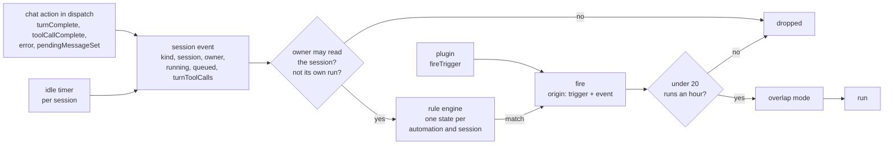
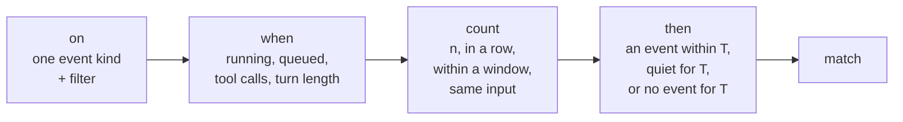
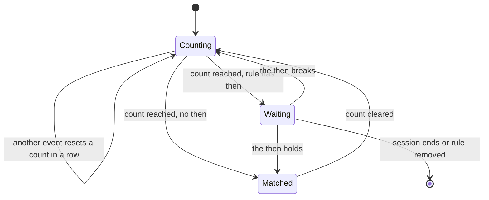
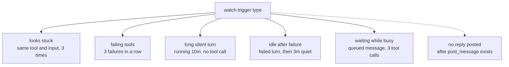
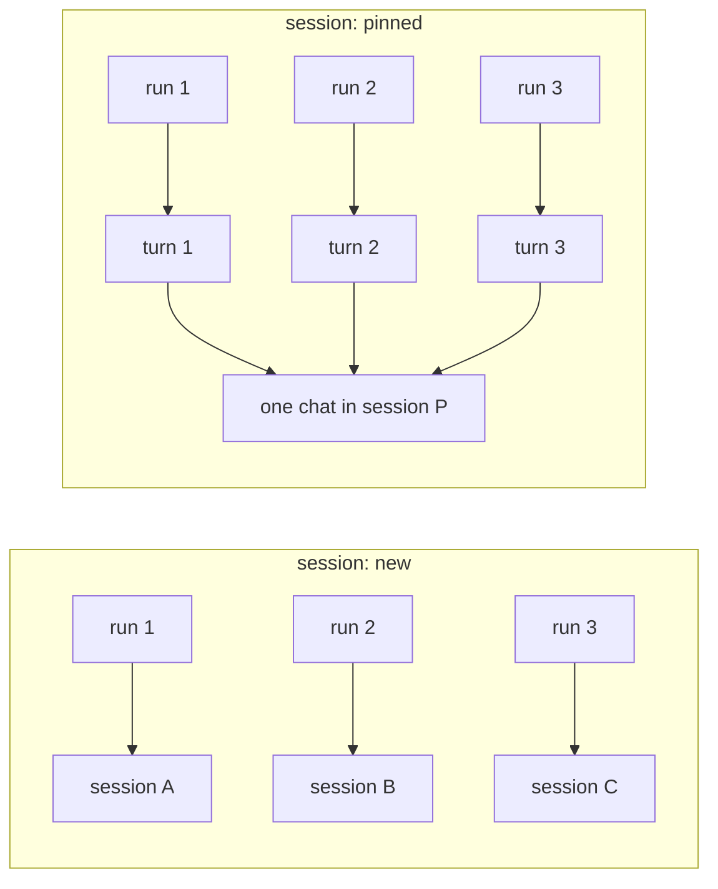
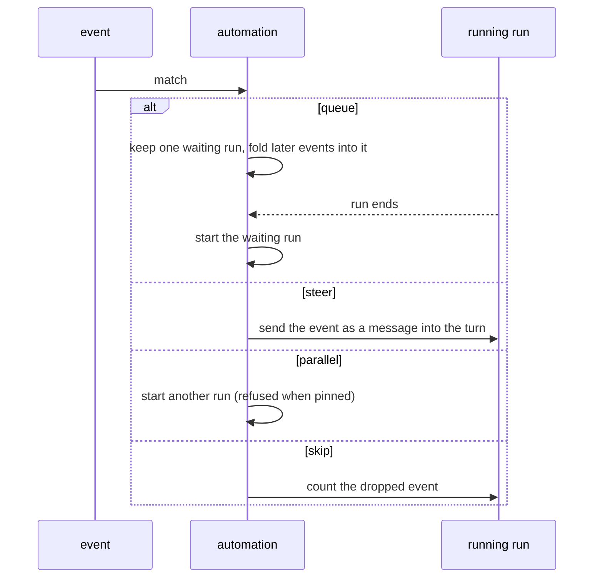
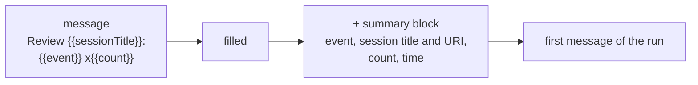
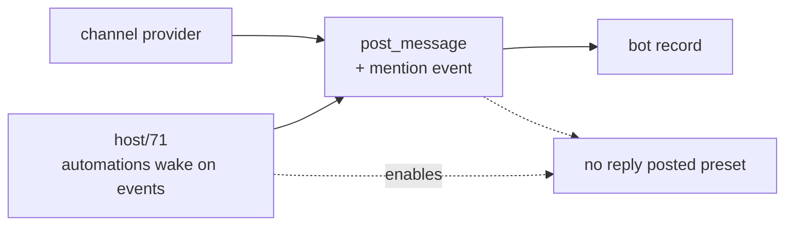

The diagrams for [plan.md](plan.md).

## From a chat action to a run

## The shape of a rule

Every rule is one event. The three other parts are optional.

| Softov's example | on | when | count | then |
| --- | --- | --- | --- | --- |
| 3 tool calls failed in a row | `toolFailed` | - | 3, in a row | - |
| A turn failed, then 3 minutes idle | `turnFailed` | - | - | quiet for `3m` |
| A turn finished and no reply within 2 minutes | `turnCompleted` | - | - | no `posted` for `2m` (waits for `post_message`) |
| A message queued while running, after 3 tool calls | `messageQueued` | running, 3 tool calls | - | - |

## One rule's state for one session

## The presets

Each preset is a `SessionRule` with its numbers open to the person.

## New or pinned

## An event while a run runs

## What the run reads

## Where this sits in the bot study

