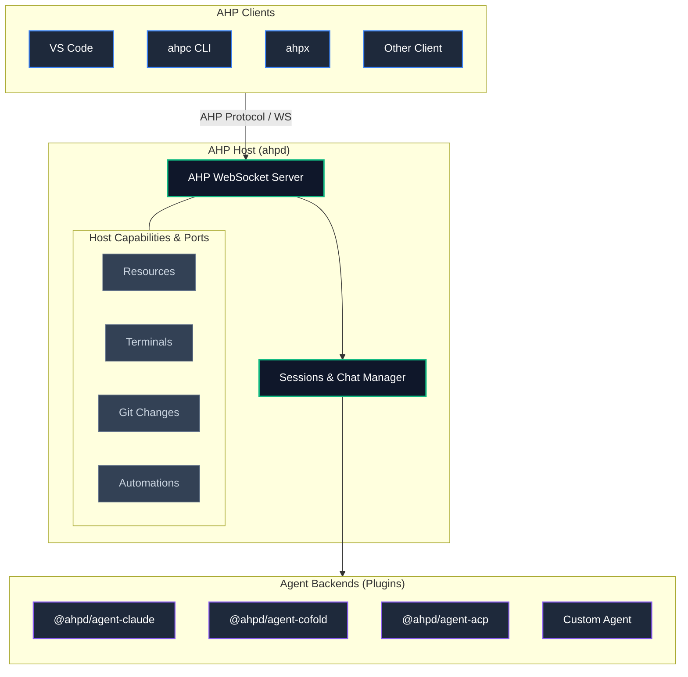
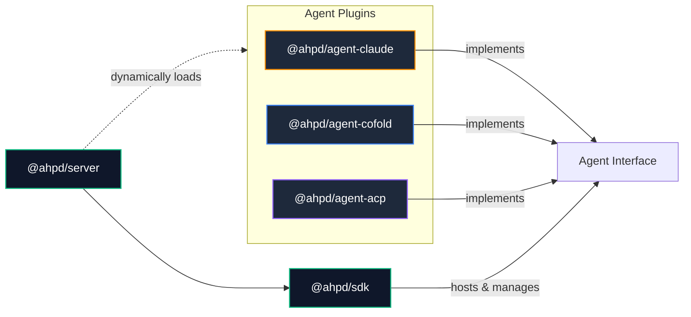

# ahpd

[](https://github.com/softov/ahpd/actions/workflows/ci.yml)
[](https://www.npmjs.com/package/@ahpd/server)
[](https://www.npmjs.com/package/@ahpd/sdk)


[](https://www.npmjs.com/package/@ahpd/agent-claude)
[](https://www.npmjs.com/package/@ahpd/agent-cofold)
[](https://www.npmjs.com/package/@ahpd/agent-acp)

An [Agent Host Protocol](https://microsoft.github.io/agent-host-protocol/) server, SDK and Plugins.

Run agents on your workstation, server, VM or container, then connect from [ahpc](https://github.com/softov/ahpc), [VS Code](https://code.visualstudio.com/), or any AHP-compliant client.

Sessions run on the host, not on the client or terminal that started them.




Close the client and the host keeps running. Reconnect from another client and the session is still there.

# Quick start

`ahpd` bundles no agent. A backend is a plugin, so the install is the daemon plus one:

Global Installation:
```bash
npm i -g @ahpd/server
cd ~/.config/ahpd && npm i @ahpd/agent-claude
ahpd --plugin @ahpd/agent-claude --path /work/project
```

A bare plugin name is resolved from the configuration directory, which is why the install happens there. Put `"plugins": ["@ahpd/agent-claude"]` in `~/.config/ahpd/config.json` to stop passing the flag.

Using npx on the fly
```bash
npx @ahpd/server --plugin @ahpd/agent-claude --path /work/project
```

The plugin still comes from the configuration directory, so the `npm i` above is needed either way.

Running from Source:

```bash
git clone https://github.com/softov/ahpd && cd ahpd
pnpm install && pnpm build
node packages/server/dist/main.js --plugin ./packages/agent-claude --path /work/project
```

Then connect an AHP client.

With [`ahpc`](https://github.com/softov/ahpc):

```bash
ahpc --host ws://127.0.0.1:9187
```

Via VS Code (`settings.json`):

```json
"chat.remoteAgentHostsEnabled": true,
"chat.remoteAgentHosts": [
  {
    "name": "ahpd",
    "address": "ws://127.0.0.1:9187"
  }
]
```

That's enough to run an agent session through AHP.


## What ahpd provides

### Persistent sessions

Agent state and turn executions live on the host server. Clients can disconnect mid-turn and reconnect later, or multiple clients can observe and drive the same session simultaneously.


### Plugins

Everything past the protocol is a plugin, named in the configuration and loaded at startup:

* **Agent backends** - Claude, OpenAI-compatible models, any ACP server, or one you write;
* **Computers** - Docker isolation, so a session runs inside a container instead of on the host;
* **Tunnels** - a public address for the port this host bound;
* **Ports, tools and URI schemes** - anything a host can be handed, a plugin can contribute.

A new capability is a package and a `--plugin` line rather than a change to the daemon.

### Host capabilities

Capabilities are modular; hosts omit unused ports without breaking client compatibility:

* **Resources** - read, write, create and delete filesystem paths;
* **Terminals** - run shell sessions;
* **Changes** - inspect and manipulate working-tree Git changes;
* **Directories** - expose repository/branch information;
* **Worktrees** - give each session its own git worktree, so two agents in one repository do not share a working tree;
* **GitHub** - expose pull-request information;
* **Automations** - schedule automated agent executions;
* **Sessions** - where the read and archived bits and a session's settings are kept;
* **Diagnostics** - what a window asks about the host itself: version, logs, network, shutdown;
* **Computers** - create disposable and isolated execution environments;
* **Containers** - run a whole host inside a dev container and carry its frames;
* **Tools** - register host-provided tools into sessions.

Capabilities are independent. A host without terminal support, for example, is still a valid AHP host.

## CLI & Daemon Configuration

### Background Service

Detach the daemon from your terminal to run persistently:

```bash
ahpd start --path /work

ahpd status
ahpd config
ahpd stop
```

`start` detaches the process from the shell.

That means the host - and any agent work it owns - can continue after the terminal that launched it has closed.

### Serving multiple projects

Host multiple repository paths simultaneously using repeated `--path` flags. Existing sessions in these paths will be catalogued automatically:

```bash
ahpd \
  --path /work/api \
  --path /work/web
```

> Note: `--path` is a catalogue entry, **not a filesystem sandbox**. Clients with access to the host may request resources or terminals elsewhere on the machine if the configured ports allow it.

### Remote access

By default, `ahpd` listens only on loopback.

To listen on another interface, configure a connection token:

```bash
ahpd \
  --host 0.0.0.0 \
  --connection-token-file ~/.ahpd/token
```

`ahpd` refuses to bind outside loopback without an explicit connection-token configuration unless that protection is deliberately disabled.

The token controls access to the host. Agent providers may additionally use their own authentication.

See [`docs/DAEMON.md`](docs/DAEMON.md) for networking, configuration and token handling.

# Extension Plugins

A plugin contributes to the host the daemon builds: a backend, one of its ports, a server tool, a URI scheme or a configuration default. Load several, and each contributes its own part of one host:

```bash
# A backend, plus the computer plugin that gives it containers to run in
ahpd --plugin @ahpd/agent-claude --plugin @ahpd/computer

# One of your own, from a directory or a single file
ahpd --plugin @ahpd/agent-claude --plugin ./my-plugin
ahpd --plugin @ahpd/agent-claude --plugin ./scratch-plugin.mjs

# Load none, whatever the configuration file says
ahpd --no-plugins
```

The same list goes in `~/.config/ahpd/config.json`, where an entry can carry options or be turned off without being removed:

```json
{
  "plugins": [
    "@ahpd/agent-claude",
    {
      "name": "@ahpd/computer",
      "options": { "image": "node:22", "max": 4 }
    },
    { "name": "./my-plugin", "enabled": false }
  ]
}
```

`--plugin` is repeatable and plugins apply in the order named. A command-line `--plugin` **replaces** the file's list rather than adding to it, the way `--path` replaces `paths`.

A plugin executes **inside the daemon process with the daemon's permissions**. Installing and enabling one is therefore a trust decision, and the configuration file is the trust boundary here the way the connection token is the port's.

One that does not resolve, whose manifest is wrong, or that throws on import or out of `apply` is reported and skipped: the daemon starts without it and the next one is still tried.

You can inspect configured plugins without loading any of them:

```bash
ahpd plugin list
```

See [docs/PLUGINS.md](docs/PLUGINS.md) for writing one and [docs/DAEMON.md](docs/DAEMON.md#--plugin-and-what-naming-one-runs) for running one.

---

# Packages

This repository is a pnpm workspace containing the AHP host, SDK, agent integrations and some plugins.

| Package                                           | Purpose                                |
| ------------------------------------------------- | -------------------------------------- |
| [`@ahpd/server`](packages/server/)                | Standalone `ahpd` daemon               |
| [`@ahpd/sdk`](packages/sdk/)                      | AHP host library                       |
| [`@ahpd/computer`](packages/computer/)            | Disposable computer support            |
| [`@ahpd/tunnel-devtunnel`](packages/tunnel-devtunnel/) | A Dev Tunnel to the port this host bound |

---

## Agents (Harnesses)

A new harness is a package and a `--plugin` line.

| Package                                      | Backend                                                                 |
| -------------------------------------------- | ----------------------------------------------------------------------- |
| [@ahpd/agent-claude](packages/agent-claude) | Claude Code through the Claude Agent SDK                                |
| [@ahpd/agent-cofold](packages/agent-cofold) | OpenAI-compatible models through cofold                                 |
| [@ahpd/agent-acp](packages/agent-acp)       | Agent Client Protocol servers such as Copilot, Codex ACP and Gemini ACP |

Name one by package, by directory, or by file:

```bash
# An installed package. `npm i` in ~/.config/ahpd is the install
ahpd --plugin @ahpd/agent-claude

# A directory with a manifest, tried against the working directory first
ahpd --plugin ./packages/agent-cofold

# A single file
ahpd --plugin ./scratch-agent.mjs

# Several, applied in the order named
ahpd --plugin @ahpd/agent-claude --plugin ./my-agent
```

The same list goes in the configuration, where an entry can carry options:

```json
{
  "plugins": [
    "@ahpd/agent-claude",
    {
      "name": "@ahpd/agent-acp",
      "options": { "provider": "copilot", "command": "copilot", "args": ["--acp"] }
    }
  ]
}
```

What each one is and the options it takes live with the package. `@ahpd/agent-acp` is one provider per configured command, so `copilot --acp`, `codex-acp` and `gemini --experimental-acp` are three entries rather than three packages.

A custom agent implements the same `Agent` interface and is named the same way. Nothing about it is different from the three above.

Nothing above the seam is reached any other way: a client speaks AHP and depends on no agent SDK at all.

The important dependency direction is:



---

# Clients (AHP)

| Example                                          | Description                            |
| ------------------------------------------------ | ------------------ |
| [softov/ahpc](https://github.com/softov/ahpc)    | An Agent Host Protocol chat and CLI client, depending on no agent SDK at all |

---

# AHP compatibility

`ahpd` targets `@microsoft/agent-host-protocol` **0.9.0**.

Summarised by area rather than by method, one row per area:

| AHP area | | ahpd | Notes |
| --- | :---: | --- | --- |
| Handshake and channels | ✅ | `initialize`, `subscribe`, `reconnect` | A dropped client replays from its last `serverSeq` |
| Sessions | ✅ | create, resume, dispose, catalogue | Past sessions come from the backend's own transcripts, resumed on the first turn |
| Chats and turns | ✅ | turns, streaming, cancellation, tools | Several chats per session, each its own agent process |
| Human in the loop | ✅ | tool confirmation, agent questions | `session/inputNeeded` is a list, so two asks are answered apart |
| Session configuration | ✅ | model, permission mode, effort, output style, sandbox, shell init | A backend advertises its own keys, including the window's two platform ones |
| Completions | ✅ | `/` commands, `@` files, config pickers | `branch`, plus any key a plugin registered an answerer for |
| Resources | 🧩 | `resources` port | Anywhere the store reaches, and a write needs no grant first |
| Client resources | ✅ | the same ten `resource*`, outbound | A client publishes a scheme and this host routes to it by URI authority |
| Resource watches | 🧩 | `resources` port | Watch lifetime follows the subscription; the protocol has no dispose |
| Terminals | 🧩 | `terminals` port | A real PTY with OSC 133 command detection where `node-pty` loads, pipes otherwise |
| Changesets | 🧩 | `changes` port | The git implementation serves all four scopes and the working-tree operations |
| Automations | 🧩 | `automations` port | Plus scheduled execution: cron in a named time zone, with nobody connected |
| Annotations | ✅ | `annotations/*` | Client-origin: this host reduces and echoes, and refuses an id it does not hold |
| Authentication | ✅ | connection token, `authenticate`, user directory | A token is per connection; `ahpd://users` is the one this host verifies itself |
| Telemetry | ✅ | `otlp/export{Logs,Traces,Metrics}` | The daemon's own lines, a turn as a server span, cumulative counters |

**✅ as specified · 🧩 through a host port · 🚧 partial · ➖ declared and not written · 🚫 deliberately not**

The implementation currently covers **31 of 32 declared commands** and **95 of 96 state actions**.

Unsupported operations return `-32601` rather than an empty success. This is intentional: reporting a missing capability is preferable to leaving a client waiting for state that will never arrive.

For the command-by-command compatibility matrix, see [`docs/AHP.md`](docs/AHP.md).

# Documentation

| Document                                   | Purpose                                                   |
| ------------------------------------------ | --------------------------------------------------------- |
| [docs/DAEMON.md](docs/DAEMON.md)           | CLI, configuration, tokens, runtimes (Node/Bun/Deno)      |
| [docs/LIBRARY.md](docs/LIBRARY.md)         | Building an AHP server with `createHost` and the ports    |
| [docs/AGENT.md](docs/AGENT.md)             | Building an `Agent` and `Session` contracts               |
| [docs/AHP.md](docs/AHP.md)                 | Detailed AHP compatibility                                |
| [`docs/PLUGINS.md`](docs/PLUGINS.md)       | Plugin system and authoring                               |
| [docs/COMPUTER.md](docs/COMPUTER.md)       | Disposable computers (Docker and KVM)                     |
| [docs/CONTAINERS.md](docs/CONTAINERS.md)   | Dev containers                                            |
| [docs/USERS.md](docs/USERS.md)             | Users and authorization                                   |
| [REFERENCE.md](REFERENCE.md)               | Protocol/reference-host decisions                         |
| [DEVELOPER.md](DEVELOPER.md)               | How to run and develop the project from source            |

# Development

```bash
git clone https://github.com/softov/ahpd
cd ahpd

pnpm install
pnpm build

pnpm test
pnpm typecheck
```

Protocol captures can be checked against the strict schema:

```bash
pnpm wire -- test/fixtures/wire.jsonl
```


---

## Build your own host

The daemon is built on `@ahpd/sdk`.

You can use the same library to embed an AHP host into another application.

### Minimal host

```ts
import { createHost, listen } from '@ahpd/sdk';
import { claude } from '@ahpd/agent-claude';

const path = process.cwd();

const host = createHost({
  path,
  agents: [claude({ paths: [path] })]
});

await listen({ port: 9187 }, (peer) => host.accept(peer));
```

This is already a working AHP conversation host.

`createHost()` handles the protocol machinery:

* negotiation;
* channels and subscriptions;
* snapshots;
* sequence numbers;
* reconnects;
* sessions and chats;
* actions;
* transcript paging.

You provide the agents and whichever host capabilities you want to expose.

### Add host capabilities

```ts
import {
  createHost,
  listen,
  fileResources,
  shellTerminals,
  gitBranches,
  gitChanges,
  githubPullRequests,
  scheduledAutomations,
  hostTools
} from '@ahpd/sdk';

import { claude } from '@ahpd/agent-claude';

const path = process.cwd();

const host = createHost({
  path,
  agents: [claude({ paths: [path] })],

  resources: fileResources(),
  terminals: shellTerminals(),
  changes: gitChanges(),
  directories: gitBranches(),
  github: githubPullRequests(),
  automations: scheduledAutomations({ file: 'automations.json' }),
  tools: hostTools(),
  onEvent: (line) => {
    process.stdout.write(`${line}\n`);
  }
});
```

Only `path` and `agents` are required.

Ports deliberately remain optional. If a capability is absent, the corresponding protocol operation reports that it is unsupported instead of pretending to succeed.

See [`docs/LIBRARY.md`](docs/LIBRARY.md) for full SDK reference.

---

## Write an agent

An agent is the backend: the thing that answers when somebody says something. The host already owns AHP, and imports no backend at all.

An `Agent` is five required members:

```ts
import type { Agent, Session, Start } from '@ahpd/sdk';

export function shout(): Agent {
  return {
    provider: 'shout',                   // what a client names in `createSession`
    displayName: 'Shout',                // what a person reads instead of the id
    schema: () => ({ properties: {} }),  // what a session can be told to do differently
    defaults: () => ({}),                // where each key sits when nothing is chosen
    create: (start) => converse(start),  // start one
  };
}
```

`create` returns a `Session`. A whole turn is three emits:

```ts
function converse(start: Start): Session {
  return {
    uri: start.uri,
    chatUri: start.chatUri,
    begin: (turnId, text) => {
      const startedAt = new Date().toISOString();
      start.emit('chat', { type: 'chat/turnStarted', turnId, startedAt, message: { text } });
      start.emit('chat', { 
        type: 'chat/responsePart', 
        turnId,
        part: { id: `${turnId}:0`, kind: 'markdown', content: text.toUpperCase() } 
      });
      start.emit('chat', { type: 'chat/turnComplete', turnId, duration: 0 });
    },

    // …and the rest of `Session`
  } as Session;
}
```

Register it like any other, and the host cannot tell it from `claude()`:

```ts
const host = createHost({ path, agents: [shout()] });
```

Everything else an `Agent` can declare is optional. See [`docs/AGENT.md`](docs/AGENT.md) for the full contracts, and [`examples/echo`](examples/echo) for the smallest one that runs.

---

## Examples

| Example                                    | Demonstrates                                               |
| ------------------------------------------ | ---------------------------------------------------------- |
| [`examples/echo`](examples/echo)           | Minimal `Agent` and `Session`, with no model or subprocess |
| [`examples/notes`](examples/notes)         | The same with tools, permissions and agent questions       |

```bash
pnpm echo  -- --port 9200
pnpm notes -- --port 9201

ahpc --host ws://127.0.0.1:9201
```

See [DEVELOPER.md](DEVELOPER.md) for development guidelines, instructions and release workflow.

# License

MIT.


