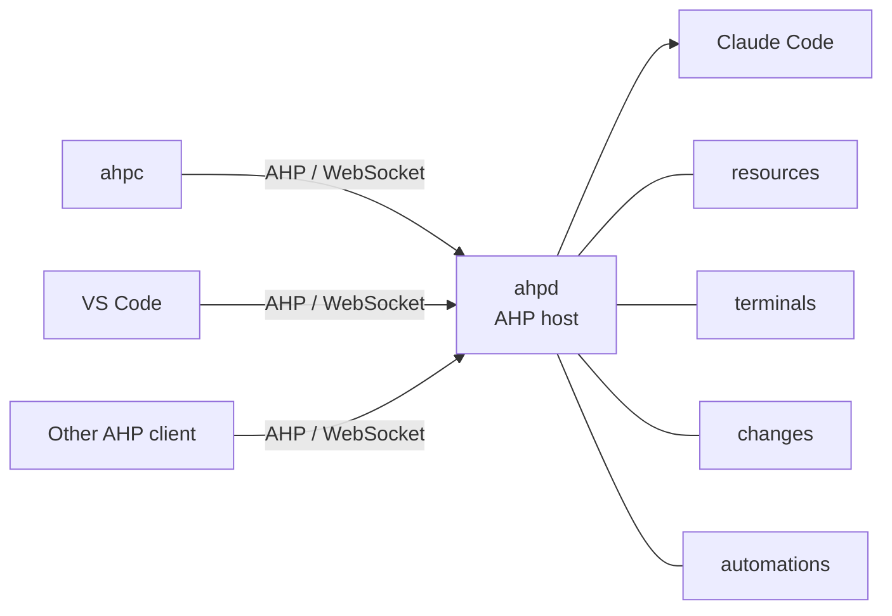

# ahpd

[](https://github.com/softov/ahpd/actions/workflows/ci.yml)
[](https://www.npmjs.com/package/@ahpd/server)
[](https://www.npmjs.com/package/@ahpd/sdk)
[](https://www.npmjs.com/package/@ahpd/agent-claude)


An [Agent Host Protocol](https://microsoft.github.io/agent-host-protocol/) server, and the library parts to build a host yourself. It ships with a Claude backend, and two more backends - cofold and ACP - are published packages of their own.

`ahpd` can be used in two ways:

- **`@ahpd/server`**: a process that serves the [Agent Host Protocol](https://github.com/microsoft/agent-host-protocol) over a WebSocket, running agent sessions behind it. It installs the `ahpd` command.
- **`@ahpd/sdk`**: the library it is built from, `createHost()` and the ports around it.

## Why

AHP's model is a **sessions server**: several clients watch and drive the same agent sessions, and none of them owns the process running the agent. That is what makes a session watchable from somewhere other than where it runs.

Today the only host that speaks it is an editor - so a session is only watchable while somebody's VS Code is open. This is the missing piece: the same protocol, the same clients, no editor.

The Claude Agent SDK is the opposite shape - it spawns a CLI that your process alone owns. `ahpd` bridges the two.



The clients on the left are interchangeable and none of them owns the session. `Claude Code` on the right is one agent, reached through `Agent` - `examples/` has two more. The four below are the **ports**: everything that touches the machine, handed to the host rather than reached for by it.

## What you can do with it

- Run agent sessions on one machine and drive them from another, from more than one client at a time, with the turn surviving the client that started it.
- Point **VS Code** at it (`chat.remoteAgentHosts`) or any other AHP client; [`ahpc`](https://github.com/softov/ahpc) is the terminal one used here.
- Read and write files, open a shell, and see what a session changed in the working tree - each through a port the host is given rather than one it reaches for.
- Run an agent on a clock, with nobody connected: `scheduledAutomations({ file })` is a cron in a named time zone that starts sessions by itself.
- Serve a backend that is not Claude, on the same host, with none of the protocol re-implemented.

## Install and run the daemon

```bash
npm i -g @ahpd/server
ahpd --path /work/project
```

```bash
# Or using npx on the fly
npx @ahpd/server --path /work/project
```

```bash
# To run it from source instead
git clone https://github.com/softov/ahpd && cd ahpd
pnpm install && pnpm build
node packages/server/dist/main.js --path /work/project
```

The rest of this README writes `ahpd` for that command, the flags and options are the same whether installed globally, run with npx, or from source.

See [DEVELOPER.md](DEVELOPER.md) and [REFERENCE.md](REFERENCE.md) for implementation details.

### Run in the background
```bash
ahpd start --path /work
ahpd status
ahpd stop
ahpd config                  # where the configuration is, and what it says
```

`start` detaches, so the daemon outlives the shell that began it - which is the point of a sessions server: close the terminal and the turn keeps running, attach again from somewhere else.

When a newer `@ahpd/server` is on npm, `start` and `status` say so on one more line, read from a file the daemon refreshes in the background six hours apart; `--no-update-check`, `NO_UPDATE_NOTIFIER`, `CI` or `"updateCheck": false` in the configuration switch it off. See [docs/DAEMON.md](docs/DAEMON.md).

### Load a plugin

A plugin is an installed package that contributes a backend, a port, a server tool or a configuration default, named on the command line or in the configuration file:

```bash
ahpd --plugin @ahpd/agent-cofold --plugin ./my-plugin
```

`--plugin` can be repeated and `--no-plugins` loads none, whatever the file says. The same list goes in the configuration:

```json
{ "plugins": ["@ahpd/agent-cofold", { "name": "./my-plugin", "enabled": false }] }
```

Naming a plugin **runs its code in the daemon's process with the daemon's permissions**, so installing one is the trust decision. `ahpd plugin list` says what the configuration names and what a run would load, without importing any of it. See [docs/PLUGINS.md](docs/PLUGINS.md) for writing one and [docs/DAEMON.md](docs/DAEMON.md#--plugin-and-what-naming-one-runs) for running one.

### Catalogue more than one directory

`--path` names a directory on the **host machine** and can be repeated:

```bash
ahpd \
  --path /work/api \
  --path /work/web
```

Past sessions in any of them are listed, and the first is the default when a client does not choose one.

It is not a fence: a client may start a session, open a terminal or read a file anywhere on the machine, as it may on the reference host. The connection token is what decides who may ask.

### To expose it elsewhere:

The daemon binds loopback and takes no token, which needs no secret: anything reaching `127.0.0.1` is already on this machine. Binding anything else without one of `--connection-token`, `--connection-token-file` or `--without-connection-token` refuses to start.

```bash
ahpd \
  --host 0.0.0.0 \
  --connection-token-file ~/.ahpd/token
```

See [docs/DAEMON.md](docs/DAEMON.md) for the complete CLI, the configuration file, tokens, and running on Bun or Deno.

## Connect a client

With [`ahpc`](https://github.com/softov/ahpc):

```bash
ahpc --host ws://127.0.0.1:9187
```

Or VS Code, in `settings.json`:

```json
"chat.remoteAgentHostsEnabled": true,
"chat.remoteAgentHosts": [
  { "name": "ahpd", "address": "ws://127.0.0.1:9187" }
]
```

A path named by a client always refers to the **host's filesystem**, never the client's.

## Use it as a library

`createHost()` implements the AHP side:

* negotiation;
* channels and subscriptions;
* snapshots;
* sequence numbers;
* reconnects;
* sessions and chats;
* actions;
* transcript paging.

You provide the agents and, optionally, the things that touch the machine.

### Minimal host

The smallest host that works is three things: a backend, a host to serve it, and a socket to serve it on.

```ts
import { createHost, listen } from '@ahpd/sdk';
import { claude } from '@ahpd/agent-claude';

const host = createHost({
  path: process.cwd(),
  agents: [claude({ paths: [process.cwd()] })],
});

await listen({ port: 9187 }, (peer) => host.accept(peer));
```

That is already a working AHP conversation host.

What it does *not* serve is anything that touches the machine, because `createHost` imports no filesystem, no subprocess and no `git`.

Those arrive as **ports**, and each is optional and independent:

```ts
import { createHost, listen, fileResources, shellTerminals, gitBranches, gitChanges, githubPullRequests, scheduledAutomations, hostTools } from '@ahpd/sdk';
import { claude } from '@ahpd/agent-claude';

const host = createHost({
  path: process.cwd(),
  agents: [claude({ paths: [process.cwd()] })],

  resources: fileResources(),                 // files a client may read and write, and `@` completion
  terminals: shellTerminals(),                // a shell, as a terminal channel
  changes: gitChanges(),                      // what the working tree has that HEAD does not
  directories: gitBranches(),                 // which branch each served directory is on
  github: githubPullRequests(),               // and the pull request GitHub has for it
  automations: scheduledAutomations({ file: 'automations.json' }),        // agents on a clock, with nobody connected
  tools: hostTools(),                         // tools the host contributes to every session

  onEvent: (line) => process.stdout.write(`${line}\n`),
});
```

Only `path` and `agents` are required.

Leave a port out and the commands behind it answer `-32601` - the same answer this host gives for anything else it does not serve - rather than failing part-way through one.

Reading a file is `node:fs` on one runtime and something else on another; a terminal is a subprocess; a branch is a *binary* that may not be installed at all. A host without one of them is not a broken host, it is a smaller one.

[docs/LIBRARY.md](docs/LIBRARY.md) has `createHost` option by option and what each port has to implement.

## Write an agent

An agent is the thing that answers. It says what it is called, what a session of its kind can be configured with, which sessions it already has, and how to start one - and everything the protocol requires stays the host's.

```ts
import { createHost, listen } from '@ahpd/sdk';
import { notes } from './agent.js';

const host = createHost({ path, agents: [notes({ path })] });
await listen({ port: 9201 }, (peer) => host.accept(peer));
```

Five members are required - `provider`, `displayName`, `schema`, `defaults`, `create` - and what you leave out is a real answer rather than a gap: no `list` means no sessions to browse, no `probe` means no models until a session of yours reports some. `createHost` cannot tell one agent from another, so a backend of your own and `claude()` are registered the same way and can be served side by side.

[docs/AGENT.md](docs/AGENT.md) is the `Agent` and `Session` contracts, config keys, and the rules that produce a wrong screen rather than an error. The [examples](#examples) below are both complete and both run.

## How compatible is it with AHP

Against **`@microsoft/agent-host-protocol` 0.9.0**, by area rather than by
method. ✅ as specified · 🔀 adapted · 🧩 through a host port · 🚧 partial ·
➖ nothing decided · 🚫 deliberately not.

| AHP area | ahpd | Status | Notes |
| --- | --- | :---: | --- |
| Handshake and channels | `initialize`, `subscribe`, `reconnect` | ✅ | Version negotiated in the client's order of preference; a dropped client replays from its last `serverSeq` |
| Sessions | create, resume, dispose, catalogue | ✅ | Past sessions are reconstructed from Claude transcripts, and resumed only once somebody starts a turn on one |
| Chats and turns | turns, streaming, cancellation, tools | ✅ | Several chats can share one session, each on its own agent process |
| Human in the loop | tool confirmation, agent questions | ✅ | `session/inputNeeded` is a list, so two tools asking at once are answered apart |
| Session configuration | model, permission mode, effort, output style, sandbox, shell init scripts | ✅ | A backend advertises its own properties and a client draws what it is given - the same five approval modes VS Code's own Claude host offers, and its platform's `sandboxEnabled` and `shellInitScripts`. Keys a client sends anyway (`autoApprove`, `mode`) are mapped onto that. Capabilities are discovered at startup, so a composer draws itself before any turn. `sessionConfigCompletions` is 🚫: every key here is an enum |
| Resources | `resources` port | 🧩 | Optional; reads and writes anywhere the store reaches, and a write needs no grant to negotiate first |
| Resource watches | `resources` port | 🧩 | Watch lifetime follows channel subscriptions - the protocol has no dispose command |
| Terminals | `terminals` port | 🧩 | The built-in implementation uses pipes, not a PTY, and says so rather than leaving it to be discovered |
| Changesets | `changes` port | 🧩 | The git implementation serves all four scopes and the working-tree operations |
| Automations | `automations` port | 🧩 | `ahpd` adds scheduled execution: cron in a named time zone, running with nobody connected |
| Authentication | connection token, plus agent credentials | 🔀 | A pushed token is held per connection; Claude otherwise inherits the daemon's own credentials |
| Telemetry | `otlp/exportLogs`, `otlp/exportTraces`, `otlp/exportMetrics` | ✅ | The lines the daemon writes to stdout; a turn as a server span with every tool call a child of it; and cumulative counters against the process start |
| Annotations | - | ➖ | No producer currently |

Method by method that is **31 of the 32 declared commands** and **95 of the 96
state actions**. The rest is `-32601`, said rather than quietly answered: a host
that returns an empty success to a method it lacks leaves the client waiting for
state that is never coming, which reads as a hang rather than as a missing
feature.

[docs/AHP.md](docs/AHP.md) has it command by command and channel by channel,
with what each does differently and why - and the rules a host has to keep that
fail silently rather than loudly.

## Documentation

| | |
| --- | --- |
| [docs/DAEMON.md](docs/DAEMON.md) | The CLI, the configuration file, connection tokens, Node/Bun/Deno |
| [docs/LIBRARY.md](docs/LIBRARY.md) | `createHost` and the ports, for building a host |
| [docs/AGENT.md](docs/AGENT.md) | The `Agent` and `Session` contracts, for writing a backend |
| [docs/AHP.md](docs/AHP.md) | Compatibility area by area, emitted actions, and the rules that fail silently |
| [docs/COMPUTER.md](docs/COMPUTER.md) | A disposable computer on Docker, and the Docker/KVM group commands |
| [REFERENCE.md](REFERENCE.md) | The specification and the reference host, and what each has settled |
| [DEVELOPER.md](DEVELOPER.md) | How to run and develop the project from source |

## Layout

Three packages in one repository, on pnpm: the protocol library, one backend, and the daemon that serves them. The root manifest is private and holds the workspace together.

### `@ahpd/sdk` - the protocol, and the parts to build a host

The library. It implements the protocol and everything a host needs except the agent, which is passed in. [`@ahpd/sdk` on npm](https://www.npmjs.com/package/@ahpd/sdk).

| | |
| --- | --- |
| [packages/sdk/src/types/](packages/sdk/src/types/)                 | Every shape, importing no runtime value. The contract. |
| [packages/sdk/src/rpc.ts](packages/sdk/src/rpc.ts)                 | JSON-RPC framing. Holds no socket. |
| [packages/sdk/src/listen.ts](packages/sdk/src/listen.ts)           | Accepts connections on Node, Bun or Deno. |
| [packages/sdk/src/host.ts](packages/sdk/src/host.ts)               | Channels, subscriptions, requests and state actions. Imports no backend. |
| [packages/sdk/src/resources.ts](packages/sdk/src/resources.ts)     | The `resources` port: files, reads and writes. |
| [packages/sdk/src/terminals.ts](packages/sdk/src/terminals.ts)     | The `terminals` port: a shell over pipes. |
| [packages/sdk/src/changes.ts](packages/sdk/src/changes.ts)         | The `changes` port: a changeset out of git. |
| [packages/sdk/src/git.ts](packages/sdk/src/git.ts)                 | The `directories` port: which branch a directory is on. |
| [packages/sdk/src/automations.ts](packages/sdk/src/automations.ts) | The `automations` port, without a clock. |
| [packages/sdk/src/scheduled.ts](packages/sdk/src/scheduled.ts)     | The same, with one. |
| [packages/sdk/src/catalog.ts](packages/sdk/src/catalog.ts)         | How a session is named, and what its status bits are worth. |
| [packages/sdk/src/paging.ts](packages/sdk/src/paging.ts)           | A long list of turns, served a page at a time. |
| [packages/sdk/src/index.ts](packages/sdk/src/index.ts)             | The library entry point. |

### `@ahpd/agent-claude` - one backend

Claude Code, behind the one seam a host knows: `Agent`. [`@ahpd/agent-claude` on npm](https://www.npmjs.com/package/@ahpd/agent-claude).

| | |
| --- | --- |
| [packages/agent-claude/src/claude.ts](packages/agent-claude/src/claude.ts)         | The `Agent`: what this harness is and how to start one. |
| [packages/agent-claude/src/catalog.ts](packages/agent-claude/src/catalog.ts)       | Claude's own sessions, as rows a host can list. |
| [packages/agent-claude/src/session.ts](packages/agent-claude/src/session.ts)       | One live Claude session, reduced into its channels' state. |
| [packages/agent-claude/src/transcript.ts](packages/agent-claude/src/transcript.ts) | A past Claude session read as turns. |
| [packages/agent-claude/src/probe.ts](packages/agent-claude/src/probe.ts)           | One CLI at startup, to learn what Claude offers. |

### `@ahpd/agent-cofold` and `@ahpd/agent-acp` - the other two backends

Two more implementations of the same `Agent` seam, each in its own package and
each loaded as a plugin rather than built into the daemon.

| | |
| --- | --- |
| [`@ahpd/agent-cofold`](packages/agent-cofold/) | The cofold runtime: every model its endpoint serves is a model inside one provider. |
| [`@ahpd/agent-acp`](packages/agent-acp/) | Any [Agent Client Protocol](https://agentclientprotocol.com/) server - `copilot --acp`, `codex-acp`, `gemini --experimental-acp` - as one provider per configured command. |

Both are documented in [`docs/PLUGINS.md`](docs/PLUGINS.md), including their
options and the `--plugin` line that loads each.

### `ahpd` - the daemon

The server: argv, the configuration file, and the record it keeps of itself. [`@ahpd/server` on npm](https://www.npmjs.com/package/@ahpd/server).

| | |
| --- | --- |
| [packages/server/src/main.ts](packages/server/src/main.ts)     | argv, the filesystem and stdout. The only file that reads any of the three. |
| [packages/server/src/daemon.ts](packages/server/src/daemon.ts) | Running detached, and finding the one that is. |
| [packages/server/src/config.ts](packages/server/src/config.ts) | The config file, and where this tool keeps its things. |

Everything Claude is reached only through `Agent`. It used to be duplicated: `ahpc` had a `--claude` mode that reached the Agent SDK in-process, with its own translation of it. That is gone, and the client now depends on no agent SDK at all - two implementations of one translation meant two answers to every question, and the one nobody is looking at is the one that drifts. This is the only copy.

## Examples

Two agents and a client, each complete and each running. The two agents have a README that is the part of the contract they demonstrate.

| | |
| --- | --- |
| [examples/echo](examples/echo) | The whole of `Agent` and `Session` with nothing behind it - no model, no subprocess, about two hundred lines. Its README is the contract in the order the host asks for it |
| [examples/notes](examples/notes) | The same with tools: one that runs without asking, one that waits to be allowed, and a question that is not about a tool. Its README is the rules for asking |
| [softov/ahpc](https://github.com/softov/ahpc) | An Agent Host Protocol chat and CLI client, depending on no agent SDK at all |

```bash
pnpm echo  -- --port 9200
pnpm notes -- --port 9201
ahpc --host ws://127.0.0.1:9201
```

## Development

```bash
pnpm test        # ~640 tests, no socket and no network
pnpm typecheck
pnpm wire -- test/fixtures/wire.jsonl   # a capture, against the strict schema
```

The workspace, the checks, recording the wire and how a release is published are in [DEVELOPER.md](DEVELOPER.md).

## License

MIT.
